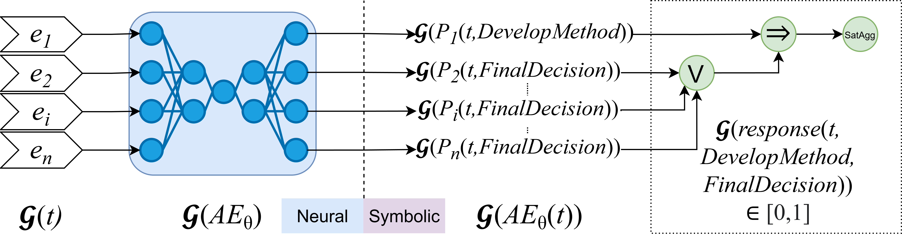

# Neuro-Symbolic Process Anomaly Detection

## Introduction

Recent developments in the field of neuro-
symbolic AI have introduced Logic Tensor Networks (LTN) as a means to inte-
grate symbolic knowledge into neural networks using real-valued logic. In this
work, we propose a neuro-symbolic approach that integrates domain knowl-
edge into neural anomaly detection using LTN and Declare constraints. 

## Recommended Reading

We strongly recommend reading the following works and their implementations:

1. Badreddine, S., Garcez, A.d., Serafini, L., Spranger, M.: Logic Tensor Networks. Artificial Intelligence 303, 103649 (Feb 2022), arXiv:2012.13635
2. Nolle, T., Luettgen, S., Seeliger, A., Mühlhäuser, M.: Binet: Multi-perspective business process anomaly classification. Information Systems 103, 101458 (2022)

## Structure of the work

### Prerequisites

Please make sure that `LTN, Tensorflow, pm4py, Declare4py, sqlalchemy` libraries are installed.

### Notebooks

1. Notebooks `00_Example Process.ipynb, 00_Generation Algorithm.ipynb, 00_Dataset Generation.ipynb, 00_Dataset Information.ipynb` correspond to Generation of the original anomalous event logs.
2. Notebooks `00_BPIC Datasets.ipynb, 00_bpic12_declare_dataset_conversion.ipynb, 00_dataset_stats.ipynb, 00_declare_dataset_conversion.ipynb` correspond to converting the datsets into a declare miner friendly format.
3. In total, 11 event logs are generated and used - `Paper, P2P, Small, Medium, Large, Gigantic, Huge, Wide, BPIC12, BPIC13, BPIC17`.
4. Notebooks starting with `01` correspond to performing Declare rule mining on the event logs.
5. Notebooks `02_bpic12_dataset_data_exploration` and `02_paper_dataset_data_exploration` correspond to performing Declare constraints exploration on the respective event logs.
6. Notebooks starting with `03` correspond to performing evaluations of our approach against the baseline approach.

